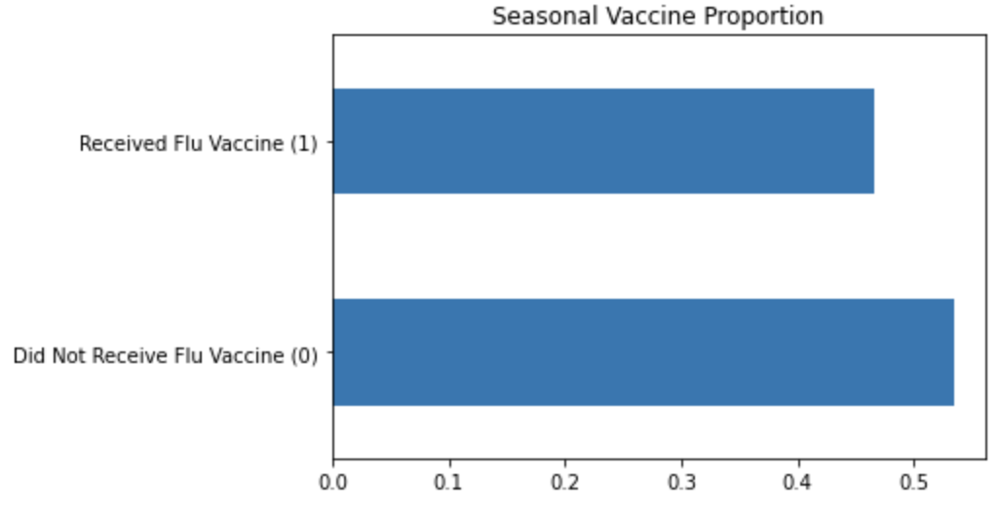
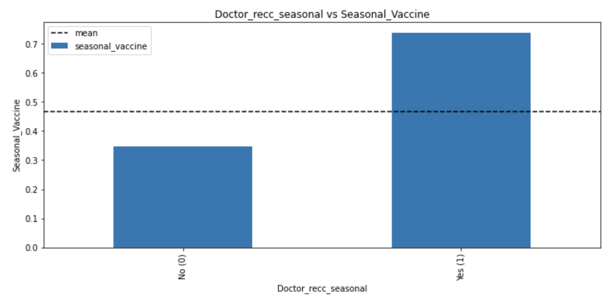

# Seasonal Flu Vaccine Analysis

**Author**: [Michael Tsypin](email:mtsypin9@yahoo.com)

## Overview

The purpose of this project is to create a model that helps a pharmaceutical company highlight the key factors of people's reasoning behind receiving the seasonal flu vaccine. Using predictive models, we will analyze data from the National 2009 H1N1 Flu Survery dataset and examine which factors are more likely to lead a person to receive the seasonal flu vaccine.

## Business Problem

A pharmaceutical company wants to understand the driving factors for consumers when developing a new flu vaccine. The key components the pharmaceutical company wants to touch on are people's backgrounds, opinions, and health behaviors regarding the likelihood of them receiving the vaccine. Using data from the National 2009 H1N1 Flu Survey, we can predict who is most likely to receive the vaccine based on these driving factors.

## Modeling



Utilizing predictive modeling to find key features for receiving seasonal flu vaccine

## Evaluation

Consumers who believed they were at a higher risk of contracting the flu received the seasonal flu vaccine more compared to those thinking they were at a lower risk.


Consumers who had the seasonal flu vaccine recommended to them by their doctor received the vaccine more than those who were not recommended by their doctors.



Consumers who strongly believed the seasonal flu vaccine was effective received the vaccine more than those that had less belief in the vaccine's effectiveness.


## Conclusion

The best and final model we found based on precision score was the original random forest model. This model identified the three most important features of receiving the seasonal flu vaccine as the opinion of getting sick with the flu without the seasonal flu vaccine, the opinion of the effectiveness of the seasonal flu vaccine, and wether the seasonal flu vaccine was recommended to them by their doctor or not. Based on these results, recommendations to the pharmaceutical company would be to discuss the vaccines effectiveness, wether its doctor recommended or not, and explaining the risk of contracting the flu without the vaccine when marketing their seasonal flu vaccine.

## For More Information

See the full analysis in the [Jupyter Notebook](seasonal_flu_vaccine_analysis.ipynb) or review [Presentation](seasonal_flu_vaccine_presentation.pdf)

## Repository Structure

```
├── data
├── images
├── .gitignore
├── README.md
├── seasonal_flu_vaccine_analysis
└── seasonal_flu_vaccine_presentation
```
